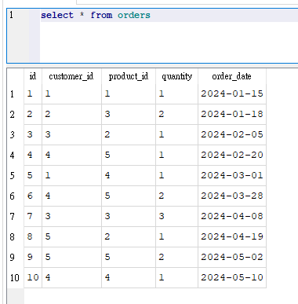
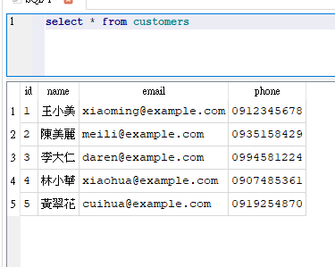
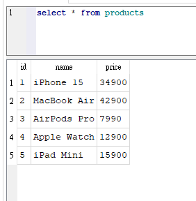
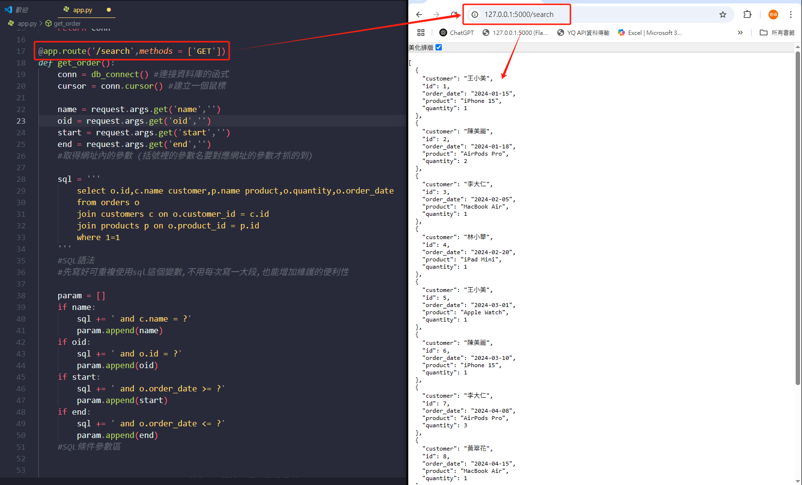
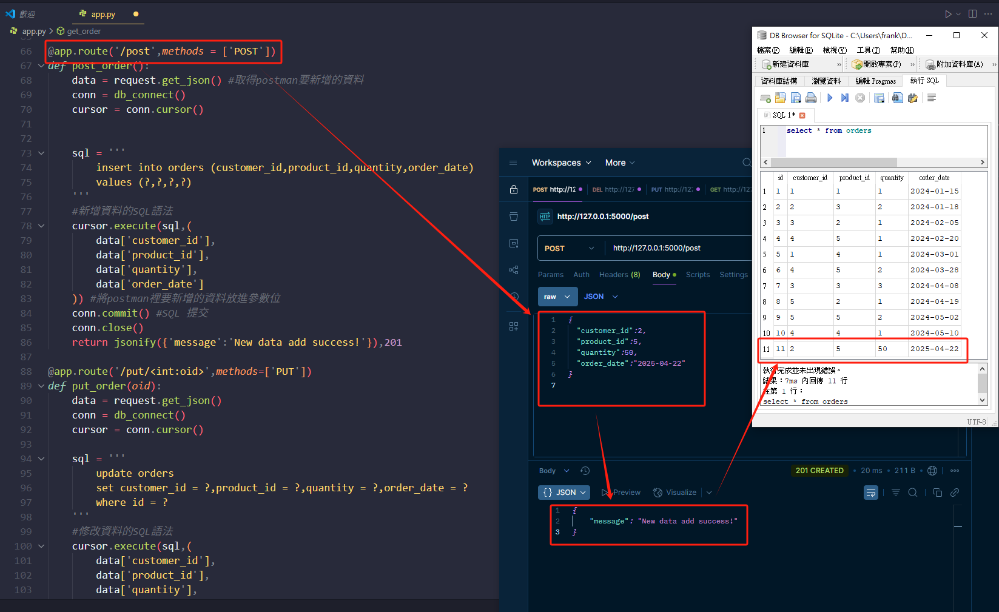
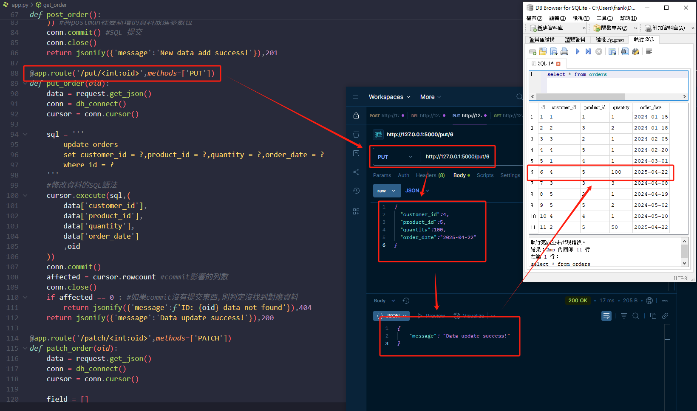
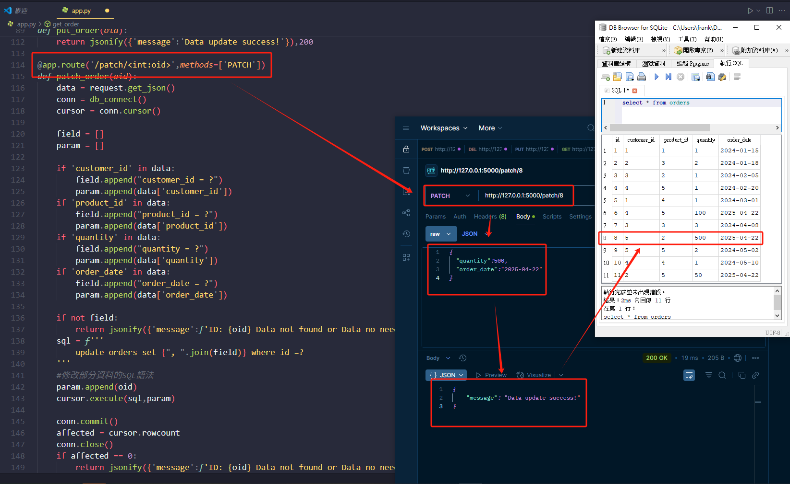
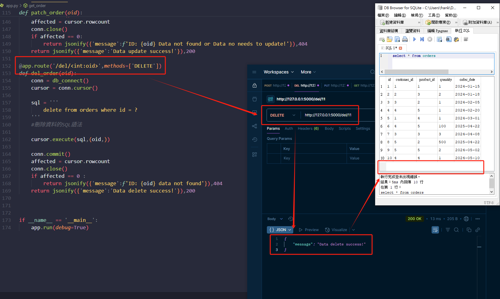

⭐Flask RESTful API + SQLite3 練習

簡介:

繼上次Flask的RESTful練習,這次增加了資料庫的功能,使用的是SQLite資料庫

其中功能包含:

新增 ( POST ) - http://127.0.0.1:5000/post

查詢 ( GET ) - http://127.0.0.1:5000/search(?name=xxx&oid=xxx&start=xxxx-xx-xx&end=xxxx-xx-xx) - 加上參數可以精準查詢

修改 ( PUT ) - http://127.0.0.1:5000/put/(id) - 選擇要修改哪一個ID

部分修改 ( PATCH ) - http://127.0.0.1:5000/patch/(id) - 選擇要修改哪一個ID

刪除 ( DELETE ) - http://127.0.0.1:5000/del/(id) - 選擇要刪除哪一個ID

    └─以上是這次使用到的資料表內容

功能使用說明:

GET可以使用連結加上對應的參數就能夠顯示對應的資料,POST、PUT、PATCH及DELETE需要透過POST MAN之類的API測試工具進行操作

參數都使用參數化查詢,以避免SQL Injection導致資料表受損

✔️python 3.12 ✔️Flask ✔️Requests ✔️jsonify ✔️SQLite3

專案結構:

interview_project
        ├─ app.py (主程式)
        ├─ README.md (程式簡介)
        ├─ database.db (資料庫檔案)
        └─ screenshot (畫面截圖 for README)
使用方法:

( Git Clone用網址 https://github.com/Frank-Pon/Flask-and-SQLite.git ) clone之後 -> 安裝所需套件 ( Flask、Requests ) -> 在終端機輸入 python app.py -> 打開網頁輸入 127.0.0.1:5000 -> 開始使用 ✅

專案學習心得:

這次的Flask練習加入了資料庫查詢功能,由於我目前工作常使用Oracle,有一定的熟練度

但為了使作品集繼續累積,且避免使用公司資料

因此選用了比較輕巧、便於使用的SQLite

再加上多次練習Flask,整體開發蠻順利的

遇到的問題多半是methods忘記寫,或是Python裡SQL的參數寫法不熟等等

但GOOGLE一下就能快速解決,

這次的專案我開始結合了不同的庫及系統來使用,讓自己稍微走到進階的程度

能夠寫出來真的讓我的信心大增

相信之後的挑戰我也能一一擊破!

